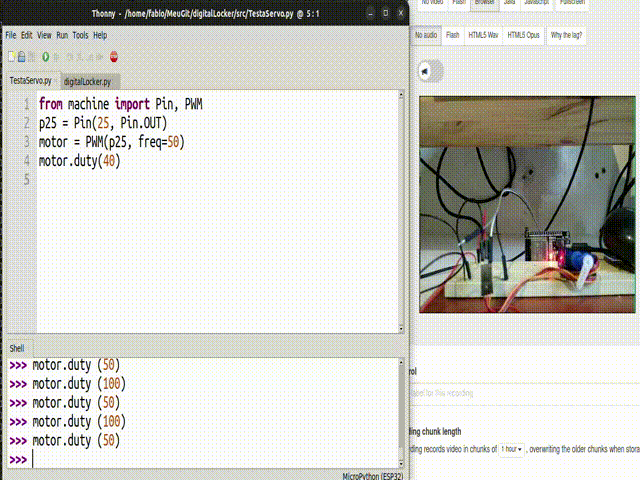

# Controlar uma fechadura usando o navegador.



## Descrição

Clicar no botão XXX para abrir, clicar no botão YYY para fechar.

O NodeMCU conecta-se ao wifi local e funciona como um servidor web. Quando o programa é iniciado, o IP é mostrado. Navegar para <IP> o que mostra a página com dois botões. O programa executado pelo Node é `digitalLocker.py`.

### Lista de Materiais

| Quantidade | Nome | Link para referência |
| --- | --- | --- |
| 1 | NodeMCU com ESP32 e cabo USB | https://www.usinainfo.com.br/nodemcu/esp32-nodemcu-iot-com-wifi-e-bluetooth-30-pinos-5147.html |
| 1 | Servomotor Tower Pro SG90 | https://www.filipeflop.com/produto/micro-servo-9g-sg90-towerpro/ |
| X | Jumpers variados | --- |
| {0,1} | protoboard | --- |
| {0,1} | fonte de alimentação - 4 pilhas e um suporte | https://www.baudaeletronica.com.br/suporte-para-4-pilhas-aa.html |

Notas: É possível fazer a montagem somente com jumpers (sem protoboard) e recebendo energia do computador através da porta USB. Talvez seja a situação mais comum. Entretanto, há computadores que não fornecem energia suficiente através da porta USB, em outros casos, o acionamento do motor causa falha da comunicação entre computador e NodeMCU. Nesses casos pode ser conveniente usar uma fonte externa de energia (ex. pilhas, carregador de celular, ...).

### Conexões

| Pino do NodeMCU | Pino do Motor | Pino das pilhas |
| --- | --- | --- |
| 25 | Laranja | --- |
| GND | Marrom | Preto (Negativo das pilhas) |
| --- | Vermelho | Vermelho (Positivo das pilhas |

**Nota**: Não conectar qualquer outro pino do NodeMCU ou do motor ao positivo das pilhas. Isso conecta 6V ao Node ou ao motor, o que pode (não necessariamente vai) danificar o Node e/ou a porta USB do computador.

## Explica como montar o dispositivo físico

Fazer as conexões listadas, configurar, transferir e executar `digitalLocker.py` no Node e navegar para o IP indicado pelo Node.

## Arquitetura e organização

Figura 1 - Feito usando yEd, arquivo-fonte da figura em /docs/Rede.graphml:


O dispositivo (digitalLocker) conecta-se ao ponto de acesso wi-fi como um cliente wi-fi e obtém um endereço IP local. Através do navegador, outros dispositivos podem navegar (fazer requisições HTTP) para o endereço IP e receberão como resposta uma página web contendo dois botões. Clicar nos botões causa o envio de uma nova requisição (HTTP:GET) que, quando recebida pelo digitalLocker, causa o giro do servo motor e o envio da resposta para o navegador.

O dispositivo pode ser visto como a interconexão do motor com o modem wifi (embutido no controlador) e o controlador. A interface entre o programador e o hardware do controlador é feita através de Micropython. O programa `digitalLocker.py` contém os comandos para conectar ao wifi (como cliente), funcionar como um servidor web e controlar o motor. Uma ilustração é apresentada na figura 2.

Figura 2- Feito usando yEd, arquivo-fonte da figura em /docs/layerModel.graphml:


## Explica como usar o programa

Para executar `digitalLocker.py` no Node, este deve estar carregado com Micropython. Instruções sobre como carregar Micropython neste [link externo](https://github.com/FNakano/CFA/tree/master/programas/Micropython). Depois de carregar, ou transferir o programa ou executá-lo usando, por exemplo WebREPL (instruções neste [link externo]()https://github.com/FNakano/CFA/tree/master/programas/Micropython/webREPL), ou o método que preferir, depois seguir os passos na descrição.

## Explica como o motor funciona

O servomotor é um motor em que o eixo gira menos de uma volta e o ângulo de giro do eixo pode ser controlado. O motor específico desta montagem permite ângulos entre zero e 180 graus (especificação técnica: http://www.datasheet-pdf.com/PDF/SG90-Datasheet-TowerPro-791970). Este motor recebe energia pelos fios marrom (GND) e vermelho (VCC). A tensão de alimentação pode ser algo entre 4V e 7.2V. Nesta montagem será 6V. O fio laranja conduz o sinal de controle para o motor.

O sinal de controle é um trem de pulsos de 20ms (50Hz), com duração do patamar em nível 1 variando entre 1 e 2ms. O ângulo de giro é proporcional à duração do patamar em nível 1. Por exemplo, com pulsos de 1,5ms durante o intervalo de 20ms, o ângulo de giro é de 90 graus (aproximadamente); com pulsos de 2ms, o ângulo é de 180 graus (https://www.engineersgarage.com/servo-motor-sg90-9g-with-89c51-microcontroller/). Esse tipo de sinal pertence à categoria dos sinais em *Pulse Width Modulation* (PWM).

Um sinal PWM é especificado pela frequência e pelo ciclo de carga (*duty-cycle*). O ciclo de carga é o percentual do tempo em que o sinal fica em nível 1 comparado com o período todo do sinal. Por exemplo, um sinal de 50Hz tem período de 20ms. Se o ciclo de carga for 20%, durante 20% desse período (ié 4ms), o sinal fica em nível 1 e o restante do tempo (16ms) fica em nível zero. Se o ciclo de carga for 50%, o patamar 1 dura 10ms e o patamar zero dura 10ms.

## Explica como enviar comandos para o motor

O ESP32 tem geradores PWM com frequência e ciclo de carga (*duty-cycle*) ajustáveis. O ciclo de carga é codificado como um inteiro entre 0 e 1023, que correspode (linearmente) ao ciclo de carga de zero até 100%. Como o motor responde a um sinal de duração de 1-2ms, o comando do ESP vai de aprox. 50-100.

Para usá-los com Micropython, digitando o programa abaixo, o servo é colocado em um ângulo perto de zero. `motor.duty()` pode ser executados com outros valores, por exemplo, 60, 100, 120, para diferentes ângulos.

```python
from machine import Pin, PWM
p25 = Pin(25, Pin.OUT)         # configura o pino 25 como saída
motor = PWM(p25, freq=50)      # configura o pino 25 como PWM a 50Hz
motor.duty(40)                 # o patamar 1 dura 40/1024 do período 
```
Fonte: https://docs.micropython.org/en/latest/esp8266/tutorial/pwm.html#control-a-hobby-servo

## Explica como o programa foi feito

```python
p25 = Pin(25, Pin.OUT)
motor = PWM(p25, freq=50)
motor.duty(40)
```
Fonte: https://docs.micropython.org/en/latest/esp8266/tutorial/pwm.html#control-a-hobby-servo

```python
s.bind(('', 3000))   # bind to port 3000 https://docs.micropython.org/en/latest/library/socket.html#socket.socket.bind
s.listen(2)  # allow for 2 connection before refusing https://docs.micropython.org/en/latest/library/socket.html#socket.socket.listen
```

Uma requisição GET é feita (pelo navegador) concatenando, à URL (que endereça a requisição para o servidor), os parâmetros, no formato `?<id>=<valor>` no texto da requisição.

```python
    request = conn.recv(1024)  # get bytes https://docs.micropython.org/en/latest/library/socket.html#socket.socket.recv
    request = str(request)     # convert to string
```

Sobre o texto (string) da requisição, busca-se o parâmetro do GET:

```python
locker_on = request.find('/?locker=on') # find get request text https://www.w3schools.com/python/ref_string_find.asp
```

Em função do valor, o eixo do motor é girado a mais ou a menos:

```python
    if locker_on == 6:
        print('LOCKER ON')
        motor.duty(110)
        locker_state = "ON"
    if locker_off == 6:
        print('LOCKER OFF')
        motor.duty(40)
        locker_state = "OFF"
```

Ao final, a página é reenviada (não precisaria), para permitir um novo comando abre/fecha, junto com um código de resposta `HTTP-200` que significa OK (https://developer.mozilla.org/en-US/docs/Web/HTTP/Status).

## Referências

https://randomnerdtutorials.com/esp32-esp8266-micropython-web-server/
https://docs.micropython.org/en/latest/esp8266/tutorial/network_tcp.html#http-get-request


## Colaborar usando github (meta)

A maneira indicada pelo mantenedor do github para colaborar com projetos hospedados nele é através de bifurcação e pull request: https://stackoverflow.com/questions/32750228/how-to-contribute-to-someone-elses-repository.

É possível ser colaborador do projeto e fazer pull/push (https://stackoverflow.com/questions/42619669/how-to-make-branch-from-friends-repository), mas isto pode gerar confusão (quando fiz isso com outra pessoa eu a confundi e ela acabou reiniciando o repositório - `git init` - não foi um bom resultado).

Quando procurei essa informação, nas postagens, encontrei um material interessante sobre a organização (interna) do git: https://stackoverflow.com/tags/git/info

Sobre bifurcação: https://docs.github.com/pt/get-started/quickstart/fork-a-repo, https://docs.github.com/en/pull-requests/collaborating-with-pull-requests/working-with-forks/about-forks.

